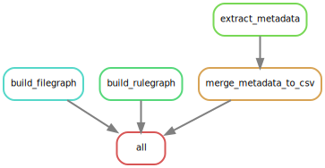

# Animal Tracking Pipelines

Snakemake pipelines for processing videos of animals, in the lab, in the zoo, and in the field.

## Datasets

### Crab Field Data




## Directory Structure

Code is arranged so that related pieces are as close to each other as possible (e.g. environment files are in the same directory as the scripts that use them, scripts for the same step are in the same step directory, steps are in the same directory as the pipeline that uses them, pipelines are all in the pipelines directory):


```
pipelines/           # All pipeline code
    pipeline_name/     # Code for a specific pipeline
        README.md      # How to run the pipeline
        Snakefile           # The pipeline
        config.yaml         # Pipeline Configuration options
        docs/          # documentation
            filegraph.svg   # How files are created
            rulegraph.svg   # How steps are related
        scripts/            # All Code for individual steps
            step_name/           # Code for specific step 
               main.py           # script
               environment.yml   # conda env
               step.def          # singularity recipe
        scratch/            # Junk and experimental code, for testing things out (not used in a pipeline)
            person_name/        #  Person who created it
                anything.ipynb         # notebook files
                anything.py            # python scripts
                anything.R             # R script
                anything.Rmd           # R Markdown script
                anything.sh            # shell scripts

tools/               # Installation files for generally-needed software
    software_name/       # Files for specific software
        environment.yml     # Conda environment file (conda env create -n name -f env.yml)
        software.def        # Singularity recipe (singularity build software.sif software.def)
        software.sh         # Other bash installation files
        README.md           # Docs and explanations, if needed.


```

## Running Individual Pipelines

Generally, running the pipeline involves navigating to the pipeline's main directory and calling `snakemake` with the desired options.

Snakemake can be conda-installed or singularity installed.  Environment and recipe files can be found in the `tools/` directory.

For example, to get snakemake:
```
conda env create -n snakemake tools/snakemake/environment.yml
conda activate snakemake
```

To run a pipeline:
```
cd pipelines/pipeline_name
snakemake --cores 1 --use-conda
```

Details and configuration for individual pipelines should be found in that pipeline's directory.
